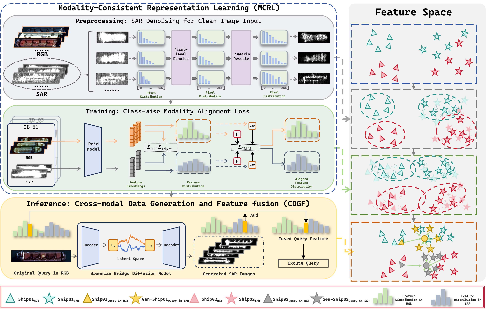

# MOS: Mitigating Optical-SAR Modality Gap for Cross-Modal Ship Re-Identification

[](https://cvpr.thecvf.com/)
[](LICENSE)
[](https://arxiv.org/abs/2512.03404) 

Official PyTorch implementation of **MOS**, a novel framework for cross-modal ship re-identification between optical and synthetic aperture radar (SAR) imagery.

## 📰 News
- **[2026.03]** Initial release of the codebase.
- **[2026.02]** Our paper is accepted to **CVPR 2026**! 

## 📖 Abstract
Cross-modal ship re-identification (ReID) between optical and SAR imagery is critical for maritime intelligence but challenged by the substantial modality gap. We propose **MOS**, a framework designed to mitigate this gap via two core components:
1.  **Modality-Consistent Representation Learning (MCRL):** Applies denoising to SAR images and utilizes a class-wise modality alignment loss to align intra-identity feature distributions.
2.  **Cross-modal Data Generation and Feature Fusion (CDGF):** Leverages a Brownian Bridge diffusion model to synthesize cross-modal samples, fusing them with original features during inference to enhance discriminability.

Extensive experiments on the **HOSS ReID** dataset show that MOS significantly surpasses state-of-the-art methods, achieving notable improvements of **+3.0%**, **+6.2%**, and **+16.4%** in R1 accuracy under ALL-to-ALL, Optical-to-SAR, and SAR-to-Optical settings, respectively.

<p align="center">
  
  <br>
  <em>Figure 1: Overview of the proposed MOS framework.</em>
</p>

## 🚀 Main Contributions
- Proposed a novel framework **MOS** that effectively denoises SAR images and mitigates the optical-SAR modality gap during both training and inference.
- Designed **MCRL** strategy with a class-wise modality alignment loss to reduce modal distance.
- Constructed **CDGF** method using a Brownian Bridge diffusion model for cross-modal sample generation and feature fusion.
- Achieved **SOTA performance** on the HOSS ReID dataset across all evaluation protocols.

## 📊 Results on HOSS ReID Dataset

| Method | ALL-to-ALL (mAP/R1) | Optical-to-SAR (mAP/R1) | SAR-to-Optical (mAP/R1) |
| :--- | :---: | :---: | :---: |
| TransOSS (Baseline) | 57.4 / 65.9 | 48.9 / 33.8 | 38.7 / 29.9 |
| **MOS (Ours)** | **60.4 / 68.8** | **51.4 / 40.0** | **48.7 / 46.3** |

## 🛠️ Installation


### Setup
```bash
git clone https://github.com/yjzhao1019/MOS.git
cd MOS
conda create -n mos python=3.11
conda activate mos
pip install -r requirements.txt
```

### Train ReID Model

```
python train.py --config_file configs/hoss_transoss.yml
```

Our checkpoint weights can be downloaded in [here](https://drive.google.com/file/d/1UuRQ0MelcPJuTqLi6cDmzsvPkQt6rCKn/view?usp=drive_link).


### Evaluation ReID Model

```
python test.py --config_file configs/hoss_transoss.yml TEST.WEIGHT 'the checkpoint path'
```

### Utilize BBDM to generate SAR samples

Please refer [BBDM](https://github.com/xuekt98/BBDM) to train diffusion model. We pretrain the BBDM for 100 epoch on [QXS-SAROPT dataset](https://github.com/yaoxu008/QXS-SAROPT) and fine-tune 250 epochs on the HOSS ReID training set.

After get optical-SAR diffusion model, we can transfer the optical image in HOSS ReID test set to SAR modality. And the generated image dir should be specified in the `self.queryAdd_dir` and `self.galleryAdd_dir` variables within `/datasets/hoss.py`.


## 📄 Citation

If you find this work useful for your research, please cite our paper:

```bibtex
@inproceedings{zhao2026mos,
  title={MOS: Mitigating Optical-SAR Modality Gap for Cross-Modal Ship Re-Identification},
  author={Zhao, Yujian and Liu, Hankun and Niu, Guanglin},
  booktitle={Proceedings of the IEEE/CVF Conference on Computer Vision and Pattern Recognition (CVPR)},
  year={2026}
}
```


### 🤝 Acknowledgements
Our implementation is built upon [TransOSS](https://github.com/Alioth2000/Hoss-ReID). Thanks for the author's contirbution.